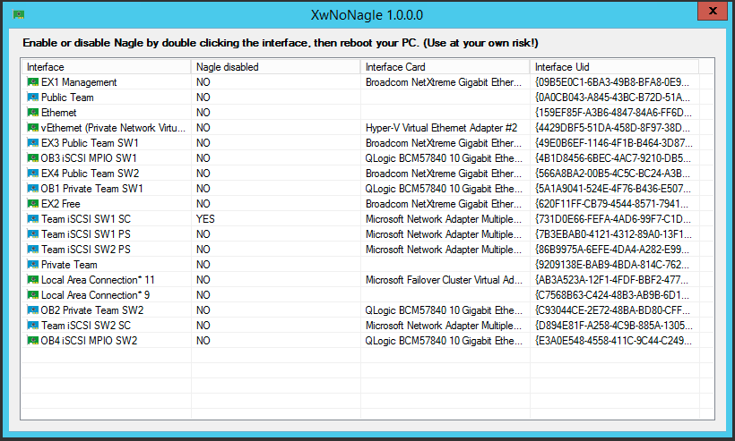

# XwNoNagle

What is Nagle?  
Well, it is a way to make less network packets jump around on a network  
More info where: https://en.wikipedia.org/wiki/Nagle%27s_algorithm

The problem is that it sometimes is better to disable it... and there is no good way apart from editing the registry  
Done by hand is a pain, so this is a case of "if you want something done..."

But why disable nagle?  
There are two main cases where people sugest disabling it:   

- Datacenter iSCSI Storage manufactorer (Dell) suggests (at this date) to disable this for some of its storage products

- Gamers, that say latency is improved on online gaming... i'm not a gamer, i will not comment on the reality of this

In any case, this is just a small tool to avoid editing the 

## In case you are feeling generous  
